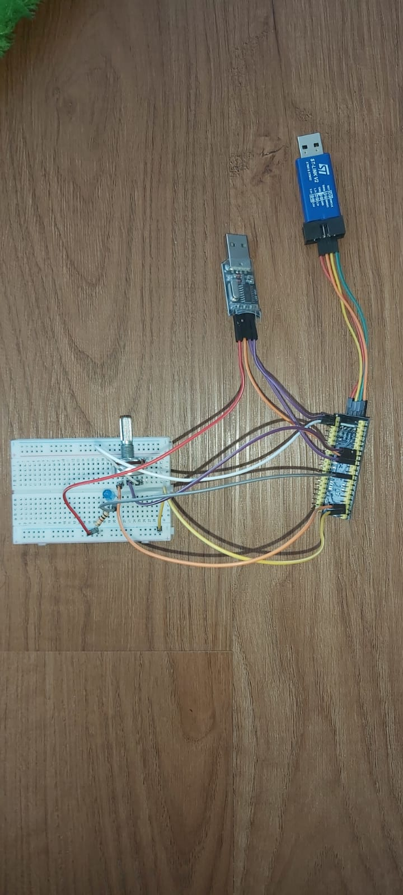
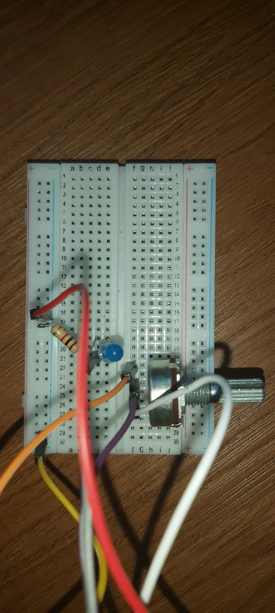
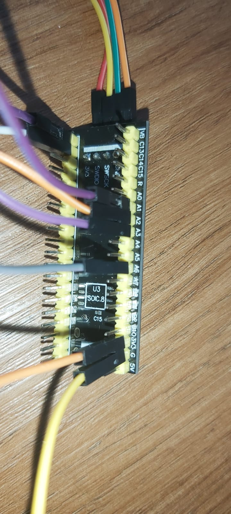
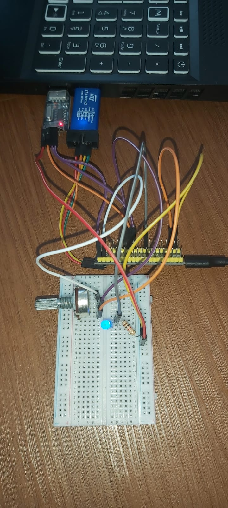
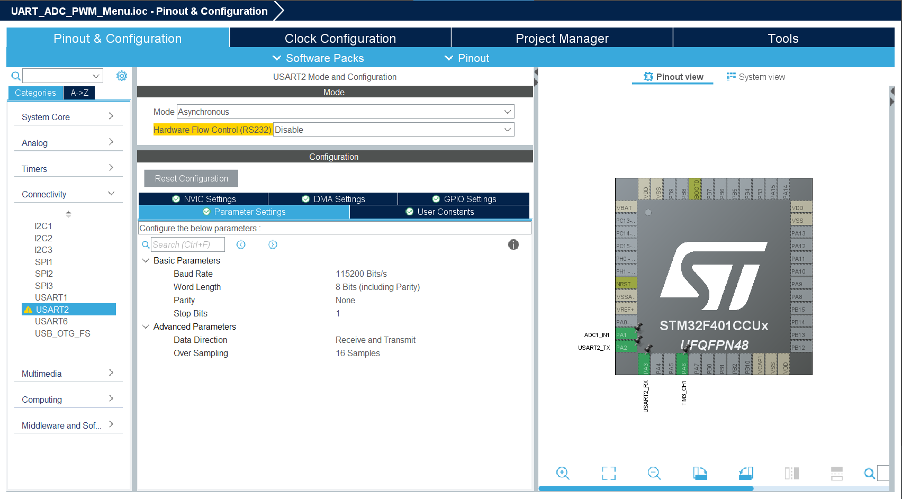
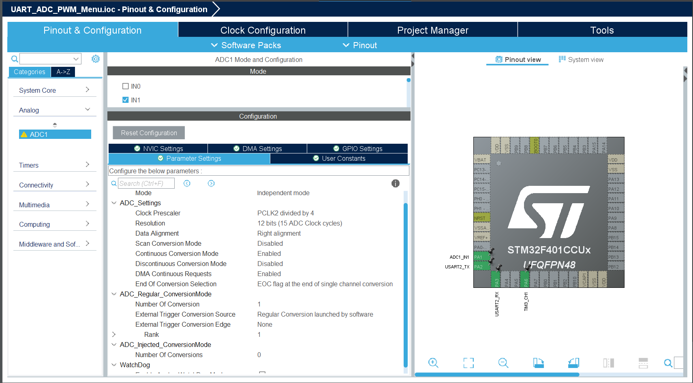
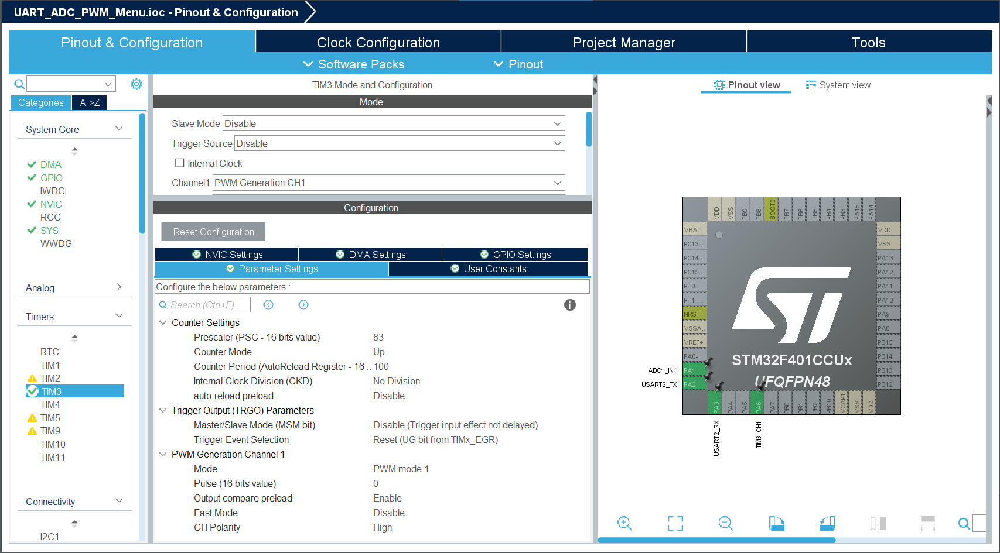
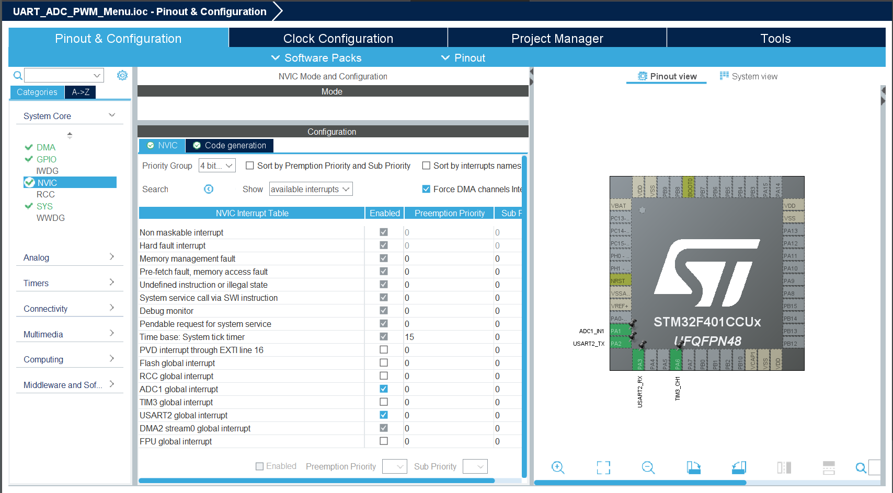
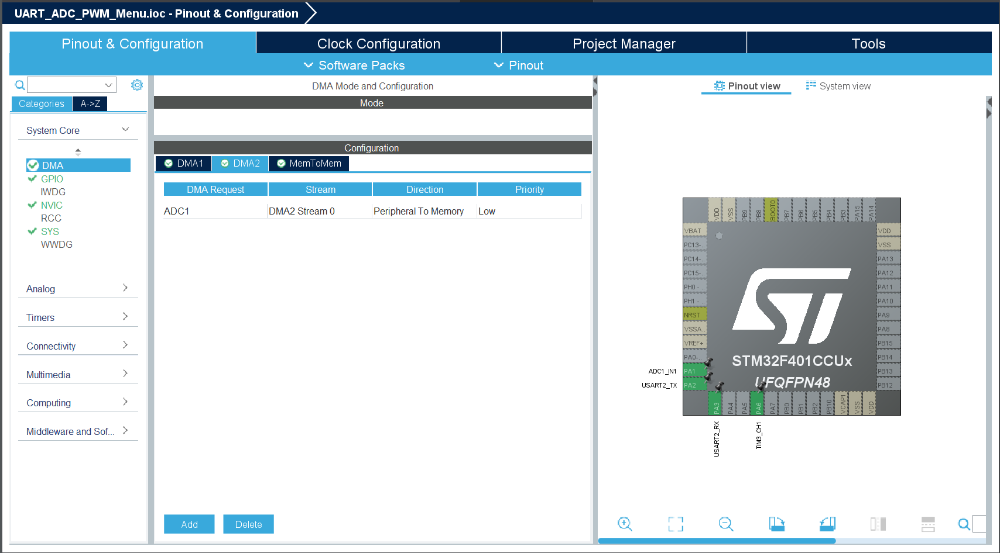

# UART ADC PWM Menu - STM32F401CCU6 Project

Proyek ini merupakan implementasi pengendalian kecerahan LED menggunakan sinyal PWM berdasarkan input potensiometer yang dibaca oleh ADC. Interaksi dilakukan melalui menu UART berbasis STM32F401CCU6. Program dikembangkan di **STM32CubeIDE** dengan **HAL Library**.

## 📚 Daftar Isi

- [🧠 Fitur Utama](#-fitur-utama)
- [📟 Struktur Menu UART](#-struktur-menu-uart)
- [⚙️ Requirements](#️-requirements)
- [🖼️ Foto Rangkaian](#️-foto-rangkaian)
- [📍 Konfigurasi IOC](#-konfigurasi-ioc)
  - [🧷 Pin Mapping (IOC Screenshot)](#-pin-mapping-ioc-screenshot)
  - [⚙️ Konfigurasi Peripheral](#️-konfigurasi-peripheral)
  - [⚡ NVIC dan DMA Settings](#-nvic-dan-dma-settings)
- [🛠️ Cara Build dan Upload](#️-cara-build-dan-upload)
- [💾 Kode Penting](#-kode-penting)
  - [💬 Menu UART di `main.c`](#-menu-uart-di-mainc)
  - [🔄 Callback ADC DMA](#-callback-adc-dma)
- [📹 Demo Video](#-demo-video)

## 🧠 Fitur Utama

- Komunikasi UART (USART2) dengan PC via Tera Term / serial monitor
- Kontrol LED PWM menggunakan potensiometer via ADC
- 4 fitur menu:
  1. Set PWM brightness secara manual (input dari UART)
  2. Baca ADC single conversion → ditampilkan di UART
  3. Baca ADC dengan DMA → rata-rata dikirim ke UART
  4. Free-running ADC dengan DMA → nilai digunakan langsung untuk atur PWM
- Semua komunikasi berlangsung di UART menggunakan menu interaktif

## 📟 Struktur Menu UART

```
--- Menu ---
1. Set Brightness PWM (0-100)
2. Read ADC (single)
3. Read ADC (DMA avg)
4. Free-running (ADC avg → PWM)
Your choice:
```

## ⚙️ Requirements

- Board STM32F401CCU6 + ST-Link V2
- Potensiometer terhubung ke **PA0 (ADC1_IN0)**
- LED eksternal pada **PA6 (PWM TIM3_CH1)**
- Tera Term untuk komunikasi UART via USB Virtual COM
- STM32CubeIDE terbaru

## 🖼️ Foto Rangkaian

Berikut adalah gambar rangkaian LED dan tombol:






## 📍 Konfigurasi IOC

### 🧷 Pin Mapping (IOC Screenshot)

Berikut ini adalah tampilan konfigurasi pin di STM32CubeIDE:


### ⚙️ Konfigurasi Peripheral

- USART2 (PA2 TX, PA3 RX):
  - Mode: Asynchronous
  - Baudrate: 115200
- ADC1 (PA1):

  - Channel IN1
  - Resolution 12-bit
  - Continuous conversion: Enabled
  - DMA continuous request: Enabled

- TIM3 PWM (PA6 - CH1):
  - Prescaler: 83
  - Period: 100
  - Output compare preload: Enabled





### ⚡ NVIC dan DMA Settings

- Aktifkan DMA2 Stream0 global interrupt
- Tambahkan DMA request: ADC1 via DMA2 Stream0
- Mode DMA: Circular




## 🛠️ Cara Build dan Upload

1. Buka project di **STM32CubeIDE**.
2. Pastikan `.ioc` sudah dikonfigurasi sesuai deskripsi di atas.
3. Build project melalui **Project > Build Project**.
4. Sambungkan STM32 ke PC via USB.
5. Upload dan buka **Tera Term** → konek ke port COM STM32.
6. Pastikan baudrate 115200, no parity, 8 data bit, 1 stop bit.
7. Ikuti menu interaktif melalui terminal.

## 💾 Kode Penting

File utama: `Core/Src/main.c`
Struktur menu dilakukan dengan `printf()` + `HAL_UART_Receive()` + sistem flag

### 🧮 Penjelasan Menu UART

```c
switch (user_choice) {
  case '1':
    // Input brightness dari user dan set PWM duty
    break;
  case '2':
    // Jalankan HAL_ADC_PollForConversion dan tampilkan hasil
    break;
  case '3':
    // Jalankan DMA ADC dan tampilkan rata-rata
    break;
  case '4':
    // Free running DMA: hasil ADC otomatis masuk ke PWM LED
    break;
}
```

### 🟩 1. **Struktur Menu (Prompt + Input)**

```c
void show_menu() {
  printf("\r\n==== STM32 UART PWM MENU ====\r\n");
  printf("1. Set PWM Brightness (0-100)\r\n");
  printf("2. Read ADC (Single)\r\n");
  printf("3. Read ADC via DMA (average of 5 samples)\r\n");
  printf("4. Free-running: ADC → PWM continuously\r\n");
  printf("5. Stop Free-running\r\n");
  printf("Choose menu [1-5]: ");
}
```

---

### 🟩 2. **PWM Setter Function**

```c
void set_pwm_duty(uint8_t duty_percent) {
  if (duty_percent > 100) duty_percent = 100;
  __HAL_TIM_SET_COMPARE(&htim3, TIM_CHANNEL_1, duty_percent);
}
```

---

### 🟩 3. **ADC DMA Callback (Rata-rata atau Update PWM)**

```c
void HAL_ADC_ConvCpltCallback(ADC_HandleTypeDef* hadc) {
  uint32_t sum = 0;
  for (int i = 0; i < 5; i++) sum += adc_dma_buffer[i];
  adc_avg = sum / 5;

  if (free_running_mode) {
    uint8_t pwm_val = (adc_avg * 100) / 4095;
    set_pwm_duty(pwm_val);
  } else {
    adc_dma_done = 1;
  }
}
```

---

### 🟩 4. **Fungsi Konfigurasi DMA Mode Dinamis**

```c
void Configure_DMA_Mode(uint32_t mode) {
  HAL_DMA_Abort(&hdma_adc1);
  hdma_adc1.Instance->CR &= ~DMA_SxCR_CIRC; // clear circular bit
  if (mode == DMA_CIRCULAR) {
    hdma_adc1.Instance->CR |= DMA_SxCR_CIRC;
  }
}
```

---

### 🟩 5. **Fungsi Menu 3 (DMA Read Once)**

```c
void read_adc_dma_avg() {
  adc_dma_done = 0;
  Configure_DMA_Mode(DMA_NORMAL);
  HAL_ADC_Start_DMA(&hadc1, adc_dma_buffer, 5);
  while (!adc_dma_done);
  HAL_ADC_Stop_DMA(&hadc1);

  uint32_t sum = 0;
  for (int i = 0; i < 5; i++) sum += adc_dma_buffer[i];
  adc_avg = sum / 5;

  printf("ADC DMA Avg: %lu\r\n", adc_avg);
}
```

---

### 🟩 6. **Fungsi Menu 4 (Free-running mode)**

```c
void start_free_running() {
  free_running_mode = 1;
  Configure_DMA_Mode(DMA_CIRCULAR);
  HAL_ADC_Start_DMA(&hadc1, adc_dma_buffer, 5);
  printf("Free-running mode started...\r\n");
}
```

---

### 🟩 7. **Fungsi Menu 5 (Stop Free-running)**

```c
void stop_free_running() {
  free_running_mode = 0;
  HAL_ADC_Stop_DMA(&hadc1);
  printf("Free-running mode stopped.\r\n");
}
```

---

## 📹 Demo Video

Demo pola nyala LED di video berikut:
👉 [YouTube Demo: UART ADC PWM Menu STM32](https://youtu.be/crZ0VCA1HTE)

## 👥 Anggota

1. Hayunitya Edadwi Pratita (23/518670/TK/57134)
2. Warda Saniia Fawahaana (23/518824/TK/57170)
